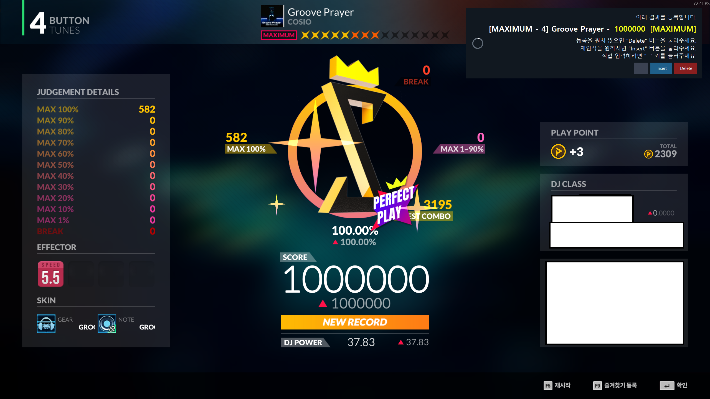

# MAXAUTO
제 3자의 서드파티 자동 업로드입니다. 

사용법(공사중)

1. 옆에보이는 Releases 에서 MAXOCR.zip 파일을 다운받습니다.
2. MAXOCR.exe가 v-archive.exe 또는 account.txt와 같은 폴더에 존재하도록 파일을 풀어줍니다.
  2-1. v-archive.exe를 한번 이상 실행하여 title.dat 파일과 account.txt가 같은 폴더에 존재하도록 만들어줍니다.
3. MAXOCR.exe를 실행합니다.
4. 모니터 화면이 2560x1440 사이즈라면, 11번까지 건너뛰어도 괜찮습니다. 그러나 인식이 불안정한 문제가 존재할 수 있습니다.
5. MAXOCR를 제대로 사용하기 위해서는 하나의 결과창 스크린샷이 필요합니다. 결과창 화면을 Print Screen 키를 이용하여 캡쳐 후, 그림판을 이용해 .png 파일로 저장합니다.
6. 왼쪽 상단 "이미지 열기" 버튼을 눌러, 자신의 모니터 사이즈에 맞는 결과창 화면을 가져옵니다.
7. 아래 사진과 비슷하게 위치를 조정합니다. 원하는 박스 클릭 후 "박스 재지정" 버튼을 눌러 박스를 새로 그리거나, 박스를 드래그하여 이동할 수 있습니다.
   7-1. 되도록 글자만 들어가게 설정하여야 오류 없이 인식이 가능합니다.

9. 트리거 박스를 설정합니다. 트리거 박스는 추후 지정할 이미지와 거의 일치할때에만 인식하므로, 변하지 않는 요소를 지정하는것을 추천드립니다.
    같이 제공된 OCR.json 파일에서는 "F5"로 설정했습니다.

10. 상단에 설정 저장을 눌러 OCR.json 파일로 저장합니다.

11. 상단에 "트리거 탬플릿 추출" 버튼을 눌러, 트리거 박스에 지정된 이미지를 저장합니다.
    
12. 시작 버튼을 누른 후, DJMAX Respect V를 플레이하면 됩니다.

     
설정칸 설명

트리거 박스 : 트리거용도로 설정된 박스를 지정합니다. 건드리지 않는것을 추천합니다.

템플릿 이미지 : 트리거 탬플릿 이미지의 경로입니다. 위의 가이드대로 따라하였다면 건드리지 않는것을 추천합니다.

저장폴더 : 스크린샷 저장이 체크되어 있으면, 저장폴더에 스크린샷과 텍스트 파일을 같이 저장합니다. 건드리지 않는것을 추천합니다.

감시간격 : 트리거 박스의 인식주기를 체크합니다. 렉이 많이걸리는 경우 감시간격을 조절해주세요.

매칭기준 : 건드리지 않는것을 추천합니다.

숫자박스 : 숫자로 인식해야하는 내용들입니다. 더이상 사용하지 않으나, 건드리지 않는것을 추천합니다.

점수반영 오버레이 시간 : 플레이 후 결과 인식 내용 오버레이 표시시간을 설정합니다. 초단위입니다.

메세지 오버레이 시간 : 기타 메세지 오버레이 표시 시간을 설정합니다. 초단위입니다.

스크린샷 저장 : 활성화 시 저장 폴더에 매 인식마다 스크린샷을 저장합니다.

감지후 Enter까지 정지 : Enter 키로 다음 인식을 받게 설정합니다. Enter 이전까지 다른 입력을 받지 않습니다.

 *Enter키로 곡 선택화면으로 돌아가거나, 곡 진입을 Enter키로 했을때 자연스럽게 이어지도록 설정되었습니다.
 
기록갱신 비교 : 로컬에 플레이기록을 저장할 지 여부를 선택합니다. 건드리지 않는것을 추천합니다.
